# Welcome to Coast Keepers!
The Coast Keepers website is a place where the local community of environmentally conscious people in Co. Kerry, Ireland can learn about the importance of coastal environment cleaning and preservation. Here, users can learn how they can help prevent further ocean pollution by cleaning their local beaches and are encouraged to sign up to participate in the local coast clean-up events. Our mission is to not only educate and encourage people to clean the local coastlines, but to also bring the local community together to strengthen intepersonal connections, meanwhile reconnecting people with our inherent relation to nature.

***

***(Designed by Iryna Walsh)***

## [View Coast Keepers Website](https://kirynaw.github.io/coast-keepers-project/)

## Table of Contents:
1. [**Exploration Phase**](#exploration-phase)
   * [***User Experience(UX)***](#user-experienceux)
      * [*User Stories*](#user-stories)
      * [*Goals*](#goals)
   * [***User Interface(UX)***](#user-interfaceui)
      * [*Wireframes*](#wireframes)
      * [*Color Scheme*](#color-scheme)
      * [*Fonts*](#fonts)
2. [**Implementation Phase**](#implementation-phase)
   * [***Website Features***](#website-features)
      * [*Features Found on All Pages*]()
      * [*Index(Home) Page*](#indexhome-page)
      * [*About Page*](#about-page)
      * [*Scedule Page*](#schedule-page)
      * [*Sign Up Page*](#sign-up-page)
   * [**Possible Future Features**](#possible-future-features)
3. [**Testing Phase**](#testing-phase)
   * [***Bugs***](#bugs)
   * [***Validator Testing***](#validator-testing)
   * [***Accessibility Testing***](#accessibility-testing)
   * [***Manul Testing***](#manual-testing)
   * [***User Story Testing***](#user-story-testing)
   
4. [**Deployment**](#deployment)
5. [**Credits**](#credits)
   * [***Digital Tools Used***](#digital-tools-used)
   * [***Code***](#code)
   * [***Content***](#content)
   * [***Media***](#media)
   * [***Acknowledgements***](#acknowledgements)

***

## **Exploration Phase:**
In this decade we can observe increased desire in people in Ireland to care for their local environment. As part of our research, when talking to residents of coastal towns in county Kerry, the common topic of conversation often is the cleanliness of our local waterways and what can local community do to prevent water pollution. 
What is the first step? 
Starting a website to educate and bring people together localy to help this environmental cause was the common answer.

Jackie, Listowel, Co. Kerry:

> *I want to be able to go online and find a local group that I can join for environmental events, clean-ups and social engagement without going  Facebook. I love our environment and I want to learn more about how I can help.*

Mairead, Ballyheigue, Co. Kerry:

> *During Covid, we were all locked up and using masks and all sorts of plastic medical items, without thinking about how it affects our environment. Now, when I walk my dog at the beach, I see masks washed up and I want to gather as a community and start cleaning it all, but I don't know where to start.*

John, Ballylongford, Co. Kerry:

> *I love our Kerry coasts and I enjoy surfing once in awhile. All I hear now is how microplastic is in everything and it really bothers me. I want to help somehow and join a group where we can learn and improve our local environment together.*

Deirdre, Community Development Officer, Banna, Co.Kerry:

> *One of the aims of my job is to develop and encourage meaningful community engagement events. My organisation have been discussing importanse of our coastal environment. We would benefit from collaborating with any local environment groups and their events. Where can we find them?*

### **User Experience(UX)**

***The Users :***  

- Local community members and community development organisations of Co.Kerry, interested in bettering our environment and learning about coastal pollution prevention.

***The Purpouse of the Site :*** 

- To spread awareness to the Co.Kerry community about coastal and water pollution, encourage to take part in coastline clean-ups and stimulate a meaningful community engagement events.

### *User Stories :*

- ***New Visitor:***
  1. I want to be able to understand what the aim of the website is from the landing page and enjoy the visual experience.
     - *I know I can do it when there are clear, organised images and text explaining the goals of the website.*

  2. I want to be able to navigate the website with ease.
     - *I know I can do it when the website has clear navigation names that direct to specific information.*

  3. I want to be able to contact website owners with ease about more information.
     - *I know I can do it when there is a link that I can press which takes me directly to my Gmail account to compose an email; that way I can see what I sent in my sent emails.*

- ***Returning Visitor:***

  4. I want to be able to learn more about website owners and educate myself about the importance of coast cleaning and how I can help the cause.
     - *I know I can do it if the website has a separate page where they go in more deapth about them and the environmental cause.*

  5. I want to be able to register my interest in the events, without fully commiting to the coast cleaning.
     - *I know I can do it if the website has a form I can fill with my detail and specify my interest.*

- ***Frequent Visitor:***

  6. I want to be able to find information about the locations and dates of cleaning events.
     - I know I can do it if the website has a separate page with a schedule of their events with dates, times and locations.

  7. I want to be able to go to a location where I can meet organisers and get free cleaning gear for coast cleanups.
     - I know I can do it if the website has a map of their base location where I can drop in to meet them.

  8. I want to be able to sign up to the specific location and date of cleaning event.
     - I know I can do it if the website has a form where I can specify the location and date of clean up I can do.

### *Goals :*

- ***Goal User :*** 
  - Learn about the importance of coastal enviroment preservation and pollution implications on our health. Take part in a beach cleaning, meet new people, social engagement, participation in new meaningful local events.

- ***Goal Site Owner :*** 
   - Teach local communities in Co.Kerry about coastal environment preservation, spread awarenes about implication of coastal pollution and gain volunteers for the future cleanup events. Avertisment of clean up events and community engagement.

### **User Interface(UI)**

The Coast Keepers website has four pages that will engage the users with it's content.

- *Home Page:* 
  - It briefly introduces the user to the ethos of the site owner, and what their social organisation can offer to their users. The header has a 'Learn More' call to action button, that takes the user to the 'About' page.

- *About Page:* 
  - Here users learn more about the website owners and how Coast Keepers initiative has started. - They also learn more about the importanse of coastal cleaning and implication of pollution on environment.

- *Schedule Page:* 
  - This page shows users the different beach locations in Co. Kerry and times and dates of the clean-up events. 
  - It also has an address, opening times and a map where it shows to users where they can go to collect their free cleaning gear.

- *Sign Up Page:* 
  - Here, users can imput their full name and email and sign up to one or more beach location cleaning events.

- *All Page Headers*
  - Have a Logo on the left and menu section of all four pages on the right.
  - The mobile version of the webiste has a icon that one can press to drop down toggle the menu bar.

- *All Page Footers:* 
  - All the footers on all pages have four action buttons that takes the user to external sites; the email, Facebook, Instagram and X(Twitter). 
  - It also has a 'Join Us' button on 'Home', 'About' and 'Schedule' pages that takes the user to the 'Sign Up' page. 
  - On the 'Sign Up' page the action button changes from the 'Join Us' to 'Home', that takes the user back to 'Home' page when clicked.

***

#### *Wireframes:*

The website is responsive on all screen types: Phones, Tablets and Laptops.

- __All Screen Functionality:__

  
  

- __Phones__

  - __Home Page:__

     

  - __About Page:__

     

  - __Schedule Page:__

     

  - __Sign Up Page:__

     

- __Tablets:__

  - __Home Page:__

     

  - __About Page:__

     

  - __Schedule Page:__

     

  - __Sign Up Page:__

     

- __Laptops:__

  - __Home Page__

     
  
  - __About Page__

     

  - __Schedule Page__

     

  - __Sign Up Pag__

     

#### *Color Scheme:*

This pallet was generated from [Coolors](https://coolors.co/)
  - This pallet reflects the beach and the ocean themes of the Coast Keepers website. 
  - The dark teal and light beige and white are good contrasting colors and the peach adds an accent.

     

The pallet was then scored on contrast levels on [Contrast Grid](https://contrast-grid.eightshapes.com/).
  - To make sure that the color combinations are not clashing and are suitable to use for accessability purpouses.
  - Here are the generated contrast autcome of the pallet:

     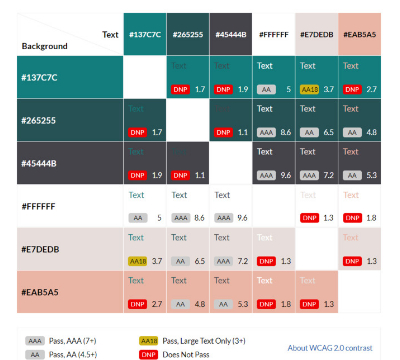

  - Here are only the colors that scored high on contrast levels and these combinations will be applied.

     
    
#### *Typography:*

The fonts were taken from [Google Fonts](https://fonts.google.com/)

  - __*Bebas Neue*__ font was used for all the headings and the logo.
  - __*Barlow*__ font was used for all the paragraphs.
  - These fonts are complimentary to each other, easy to read and are in line with the style of the website.

     

  - The icons used in the webiste where imported form [Font Awesome](https://fontawesome.com/)

     

## **Implementation Phase:**

### **Website Features**
- #### **Features Found on All Pages:**
  - Navigation:
     - The navigation bar is the same across all four pages. 
     - It is fixed and has a litte gap at the top where the contents of the page can be seen when scrolling
     - It consists of a Logo on the left and four menu items that direct users to website pages.

        

     - The Logo is the name of organisation *Coast Keepers* and the icon is a life-ring that indicates that the website has a marine theme.

        

     - The menu section has two features; 
     - The line undertheath indicates to the user the current page they are visiting.

        

     - The hover feature alows the user to highlight the page in the menu they want to visit next.

        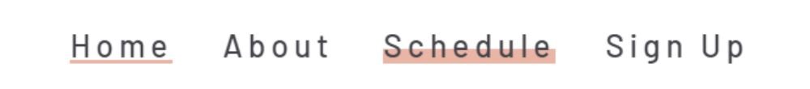

     - On phones, the navigation bar has a logo and a three wave icon.

         

     - When icon is pressed the menu drops down and users can select the page they want to visit. 

        
             
  - __Footer:__
     - The footer is the same across all page except for the *Sign Up* Page.
       
        

     - On the *Sign Up* Page the last feature icon changes its function.

        
       
     - There are four button features in the footer that take the user to different internal and external web locations.

     - When the user hovers over each of them they change color to indicate selection.

     - The first feature is the *Email Us* button; when selected, a new tab opens and the user is taken to a gmail email, ready for the user to send their query.

        <&nbsp;&nbsp;------->&nbsp;&nbsp;>
        

     - The next three features are social media buttons  for *Facebook*, *Instagram*, *X-Twitter.
     - When one is selected a new tab opens and the user is take to the chosen social media platform.

        &nbsp;&nbsp;------->&nbsp;&nbsp;
        

     - The last feature in the footer is a *Join Us* button, when selected, takes the user to the *Sign Up* Page of the website.
     - On the *Sign Up* Page, as mentioned above, the footer icon changes from *Join Us* to *Home* icon. When selected, the user is taken back to the *Home* Page.

        &nbsp;&nbsp;------->&nbsp;&nbsp;
        &nbsp;&nbsp;------->&nbsp;&nbsp;
        

- #### Index(Home) Page
  - The *Home* landing page is where the users can get a glimpse of information about the website 
    and understand their general goal.
  - The colors used have a good contrast with beige and teal, without too much information given at 
    once, using peach color highlight in text borders and hover features.
  - Coast Keeper's Landing page has a large hero image that features a had picking up a plastic 
    bottle from water.

     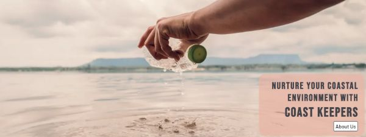

  - The moto indicates that this website is about an environmental cause.
  - This section has a button feature that directs the user to learn *About Us*, the founders and the cause itself, without scroll any further.
  - When the mouse hovers over the *About Us* button it highlights by changing color.

     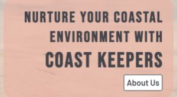&nbsp;&nbsp;------->&nbsp;&nbsp;
     
  
  - If the user chooses to scroll further, they find the outline of the *Mission* of the website.

     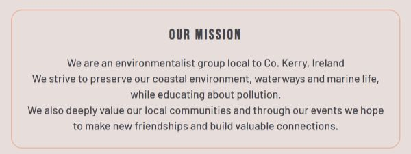

  - After the mission statement, there is an outline about activities of the organisation that can be attractive to the user, further intising them to the cause.
  - A round image border is used to make the image stand out against the text. 
  - The backround of the text is white and part of it is hidden behind the image to create an attractive design feature. 
  - As the screen stretches the images expand on the page.

     
   
  - At the end of the page there is an educational YouTube video link with a text box above giving reasons to why one might want to join the Coast Keepers cause.

     

- #### About Page
  - About page introduces the user to the story of how Coast Keepers initiative started.
  - It has a pleasent visual story flow, with the eye traveling from the image to the left and then  text to the right.

     

  - The *About Us* setion is followed by the *Reasons* section, with a strong heading and text explaining the ramifications of coastal pollution. 
  - Here the user can learn about the importance of joining the cause.
  - The text is set against deep green background with white text which stands out and makes the content very effective.

     

  - Furthe the *About* page expands on the topic of importance of the website's environmental cause, by listing four main reasons why the initiative of the website is important.
  - Here the information is more detailed and specific and gives the user deeper insight.
  - This section is not too text heaavy, preventing information overload.
  - The round image feature is carried through to About page for consistency.
  - The text boxes contract and expand depending on the screen size.

     

- #### Schedule Page
  - The Schedule Section feautures 6 separate content boxes divided by white border and set against the opaque-gray background of Ballybunion beach photo.
  - The user can find the dates, times and beach locations of cleaning and surfing events that they may choose to participate in.
  - The content boxes expand and contract deending on the screen size.

     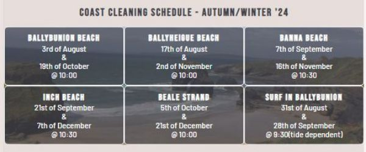

  - The *Schedule* page also feautures an imbedded google map with a pin location of the organisation
  - There is a text box, notifying the user of items that they provide for users, the address and the opening times.
  - Here the user can find a physical location where they can go and also explore on google maps.
  - It provides the times when the user can drop in, and encourages the user to come without having to get in contact first, as no phone number is provided.

     

- #### Sign Up Page
  - The *Sign Up* page is a very important feauture of the website.
  - It is set agains an image that has the same color scheme as the website.
  - The form border is peach and the form is gray and they are both opaque so the image can be fainly seen in the background. 
  - The heading color is peach to compliment the border and main text color is beige to allow content stand out against its background.

     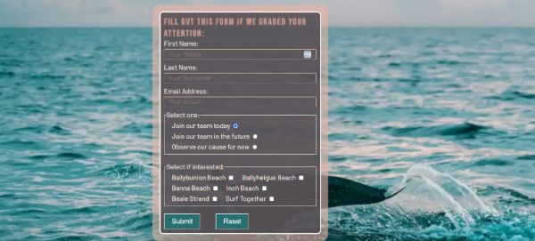

  - On this page, the users can register their interest in the website's environmenal cause.
  - The user is required to fill out their general details.
  - The form in this page has a feauture where the users have to fill ot their First Name, Last Name and Email address.
  - If the user does not fill one of those detail fields, they cannot submit the form.

     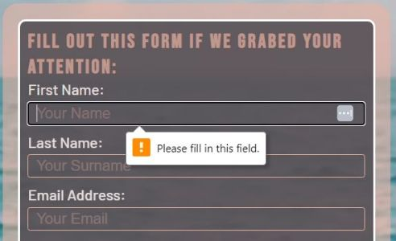
     
     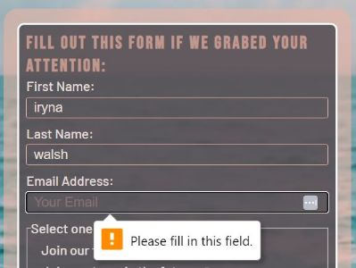

  - The radio feature gives users a choice whether they want to join the cause now, later or simply observe.
  - One answer is automatically preselected, they simply have to choose one that suits the user most.

     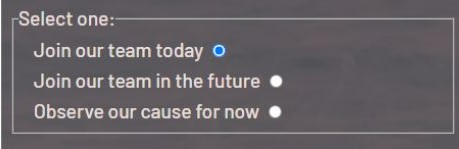

  - The form also has a checkbox feature.
  - It gives users an optional choice to chose one of the location events.
  - The options are named after the beach locations the events are taking place, corresponding with the schedule on the *Schedule* page. 
  - The selection of checbox boxes is not obligatory for succesful submition.
  - If the user is intersted they can select one or more boxes.
    
     

  - The form has a Submit and Reset button.
  - Submit button generates a feedback message that thanks the user for signing up.

     

  - The Reset button clears all the input fields and allows the user to start filling the form afresh.
  - Both buttons are green in color and text is white and when mouse is hovered over, they change color to beige background and white text.

     &nbsp;&nbsp;
     

- ### **Possible Future Features**
  - A feature where active users can log how much kg litter they collected at a location  - which then shows up as a statistic on the page.

  - Use JavaScript to add more active styling: eg. a rotating gallery of photos, more effective hover effects, icons that transforms when hovered on,

  - Set up a Cloud database where all the feedback forms would be sent.

  - A live chat section where like minded environmentalists can talk.

   

## **Testing Phase:**
The testing and validation of the code was performed throughout the website creation, and overall no major issues were detected:
  - At first we will look at the issues and bugs encounteredat the final stages of the project completion and how they were fixed. 
  - Then we will look at how the website performs once all issues were cleared.

### **Bugs**
Here are the key issues detected at the final stages of website completion and how they were fixed:
  - The website was run through [Wave](https://wave.webaim.org/) web accessibility evaluation tool, and few errors were found.

     - __Error 1: Form Label__
     - The issue was in the missing value in the *label* property.

        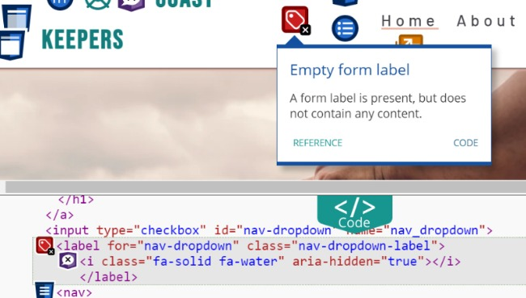

        - **Solution:** a *h2* with hidden-text *class* was created which then styled in stylesheets to apear hidden.

           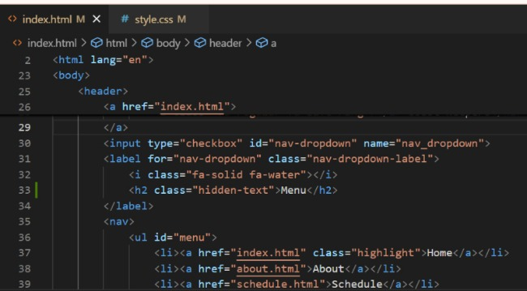
           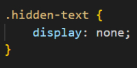
       
     - __Error 2: Fully Justified Text__
      
        

        - **Solution:** To wrap the *img* in a *div*.
        
           

     - __Error 3: Missing Fieldset__

        

        - **Solution** Wrap the *label* and *input* in *fieldset* and use *legend*s.

           

- The website was then run through the [W3C Markup Validation Tool](https://validator.w3.org/)
     - The *Index* page did not show any issue but the *About*, *Schedule*, *Sign Up* and *Submit-feedback* all showed the same errors:

        

     - The first error was the same one that was highlighted by *Wave* evalutation tool, but the solution cleared the error in *Wave* but not in the *W3C Validator*.   
     - The error  was resolved by placing **span** instead of the **h2** element, as it does not get recognised as an error becuase of its properties.

        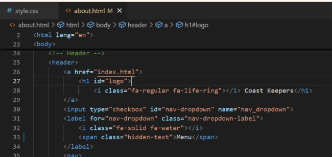

     - The fourth error, of the total error order, was a simple misplacement of the embedded *Font Awesome* Icon Kit.
     - It was fixed by wrapping in in the **body** section, as it was outside wrapped in *html* element.

        

     - The final, fifth error encoutered was when Manual Testing on *Google Chrome* and *Microsoft Edge* by using dev tool option.
     - All pages but, the *Index* page were clear of errors.
     - This error was hard to identify.

        
  
     - The different sections of .html and .css code was isolated and tested to pinpoint the issue, with no result.

        

        

- It was later discovered that it was a third party code error in the YouTube video source that was showing up, as when the embeded video link was removed, the error cleared.
- No further action was required.

### **Validator Testing**  

Once all the Bugs were cleared the website was evaluated by [W3C Markup Validation Tool](https://validator.w3.org/) and [Jigsaw: CSS Validation Service](https://jigsaw.w3.org/css-validator/)

All Website Pages and CSS Style Sheet was clear of errors.
  - Index/Home Page:

     

  - About Page:

     

  - Schedule Page:

     

  - Sign Up Page:

     

  - Submit Feedback Page:

     

  - CSS Style Sheet:

     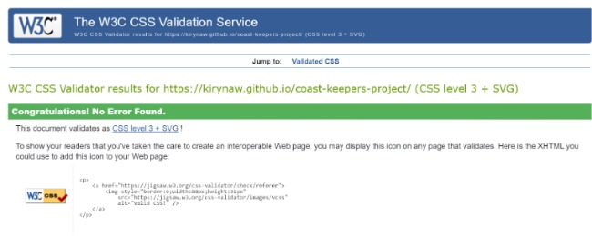 

### **Accessibility Testing:**
To check the website *Performance*, *Accessibility*, *Best Practice* and *SEO*, the website was run through the *Lighthouse* Chrome Dev Tools performance statistics generator.

- A low performance was noticed in the general website and *Index* page perforance statistic.
- It was deduced that the reason for reduced performance was the embeded YouTube video in the *Index* page.
  - Desktop:

     &nbsp;&nbsp;
     

  - Mobile:

     &nbsp;&nbsp;
     

- For testing purpouse, the video was removed and Lihthouse report was generated again and the performance was improved.
   
  - Desktop:

     

  - Mobile:

     

Despite the performance being reduced, the decision was made to keep the embeded YouTube video, as it added value to the website.

The *About*, *Schedule* and *Sign Up* page were also run through *Lighthouse* statistic generator and scored high.
  - Desktop:
     - *About Page:*

        

     - *Schedule Page:*

        

     - *Sign Up Page*

        

 - Mobile:
     - *About Page:*

        

     - *Schedule Page:*
    
        

     - *Sign Up Page*

        

### **Manual Testing**
  - **Browser Testing** 
     - Testing was conducted across three different web browsers; *Chrome*, *Edge* and *Firefox* to ensure that the website works correctly on differen browsers. 
     - No issues were detected.

  - **Website Responsivenes** 
     - Reponsiveness of the website was tested on various Phones, Tablets, Laptops and a Desktop to check for any errors. 
     - The results confirmed that the website is fully responsive across all device screens.

  - **Website Links**
     - All the iternal and external links were tested on phones and laptops as well as *Chrome* , *Edge* and Firefox Browsers. 
     - Results showed that all links are in working order and no link is broken. 
     - No other issues were detected.

  - **Website Form**
     - The test was conducted to make sure that when the form is submitted it triggers a correct response and takes the user to the designated location on the website.
     - It was tested that all the radio buttons and checkbox buttons work correctly and when the compulsary text input fields are not filled it notifies the user.
     - The Restore button was tested to ensure it clears the data that was inputed.
     - The results of these test showed no issues.

### **User Story Testing**
 
  1. I want to be able to understand what the aim of the website is from the landing page and enjoy the visual experience.
     - *I know I can do it when there are clear, organised images and text explaining the goals of the website.*

        > **Evidence:** --> The landing page has a clear graphic depicting a hand picking plastic bottle from the ocean, which is in line with websites mission theme and is an effective visual communication. The slogan "Nurture Your Coasts with Coast Keepers" further indicates that it is an environmentalist website. The 'About Us' button allows the user to eplore further into the website from the landing page. The design is clean and soft colors are used.
        >
        

  2. I want to be able to navigate the website with ease. 
     - *I know I can do it when the website has clear navigation names that direct to specific information.*

        > **Evidence:** --> The Navigation bar menu has a clear font, with well spaced out letters in all four page names. The color scheme choise in the nav bar with white background and dark grey font makes it stand out among other features on the website. Navigation bar is stuck to the top of the page when the user scrolls through the website. The hover highlight on menu items helps user see what page they are selecting and the underline feature indicates what page they are currently on.
        >
        
        >
        

  3. I want to be able to contact website owners with ease about more information.
     - *I know I can do it when there is a link that I can press which takes me directly to my Gmail account to compose an email; that way I can see what I sent in my sent emails.*

        > **Evidence:** --> The Footer of the website has an Email Us feature with a letter icon, which directs the user to email composing of Gmail when pressed. The feature is present on all pages.
        >
        
        >
        &nbsp;&nbsp;------->&nbsp;&nbsp;
        

  4. I want to be able to learn more about website owners and educate myself about the importance of coast cleaning and how I can help the cause.
     - *I know I can do it if the website has a separate page where they go in more deapth about them and the environmental cause.*

        > **Evidence:** --> The website has an "About" page that can be accessed from the landing page, be selecting an "About Us" clickable link without going throug the "Index/Home" page, and offers more in depth information about the organisers and the cause.
        >
        
        
        

  5. I want to be able to register my interest in the events, without fully commiting to the coast cleaning.
     - *I know I can do it if the website has a form I can fill with my detail and specify my interest.*

        > **Evidence:** --> on the *Sign Up* page of the website, the user can fill in their details, without fully commiting to the cause and can choose a "Join our team in the future" or "Observe our cause for now" option.
        >
        

  6. I want to be able to find information about the locations and dates of cleaning events.
     - *I know I can do it if the website has a separate page with a schedule of their events with dates, times and locations.*

        > **Evidence:** --> On the "Schedule" page of the website, the user can clearly see all the scheduled events for the "Autumn/Winter Season 2024".
        >
        
          
  7. I want to be able to go to a location where I can meet organisers and get cleaning gear for coast cleanups.
     - *I know I can do it if the website has a map of their base location where I can drop in to meet them.*
        > **Evidence:** --> The "Schedule" page of the website has a Location section with an embeded Google Map with a pined location and the Opening Times during which the user can go and collect the free cleaning gear.
        >
        

  8. I want to be able to sign up to the specific location and date of cleaning event.
     - *I know I can do it if the website has a form where I can specify the location and date of clean up I can join.*
        > **Evidence:** --> In the "Sign Up" page of the webiste the user can choose one or more beach clean-up event locations that they are interested in joining. They can select those choices when filling out the form.
        >
        

## **Deployment:**
### The following steps were take to deploy the website to GitHub pages:
  1. Log in to [GitHub](https://github.com/)
  2. Use navigation to locate [KIrynaW/coast-keepers-project](https://github.com/KIrynaW/coast-keepers-project) in *"Your Repositories"*.
  3. In the selected repository press the *"Settings"* tab.
  4. On the left hand side, press the *"Pages"* tab.
  5. Locate the **"Source"** section and make sure it is set to "Deploy from Branch".
  6. Next, under the **"Branch"** section, extend the drop-down list and select "Main".
  7. The page then automatically confirms successful deployment and displays a link to the website.

  A live link to the website can be found here: [Coast Keepers](https://kirynaw.github.io/coast-keepers-project/)

## **Credits:**
### **Digital Tools Used**
### **Code**
### **Content**
### **Media**
### **Acknowledgements**

